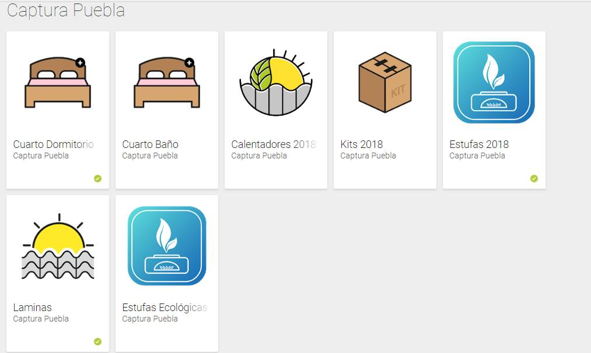

Captura Puebla is a multiple app project, currently with my team we have published 7 of this kind of apps. The basic functionality is that staff who deliver or build products, that are given to beneficiaries of social programs , upload evidence via their android phones enabling real time updates for both bussiness and goverment officials. At the end of the program we generate reports which are reviewed and stored by goverment officials.

With this apps we could dramatically improve times for reporting after the program is completed, lowering from days to just hours the creation of said reports. The real time component allowed builders to detect and solve problems in deliveries faster.

My contribution was mainly in the backend part, I developed the API first with native PHP then moved to SLIM framework. I also developed the admin panels that display the real time data with maps and statistics. For communities without access to internet we developed an offline method that syncs databases between Android's SQLite and our server MySQL.

Source: No public repository exists.
